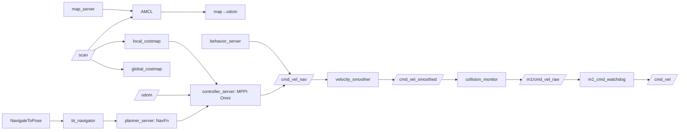
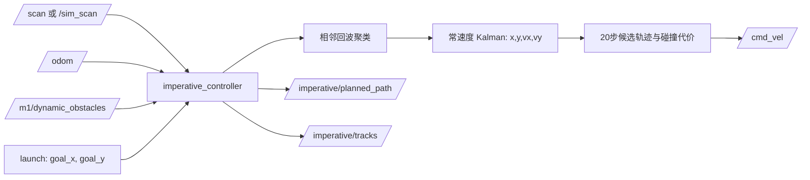
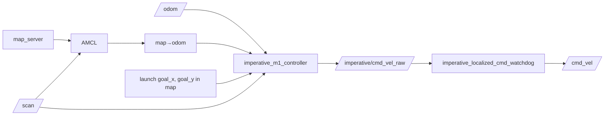

# Rosmaster M1 双算法仿真系统架构

本文档以当前 `main` 分支为准，说明三套**仿真**入口：Nav2 MPPI、默认 Imperative、localized Imperative。
实机驱动、底盘硬件激光和实机启动链不在本文范围；它们不能从 Gazebo bridge 推断出来。

## 1. 总览与启动边界

三套控制器共享同一个 M1 Gazebo 世界、机器人模型、ROS–Gazebo bridge 和 `/odom` 适配层，但同一时刻只能启动其中一套控制器，避免多个发布者竞争 `/cmd_vel`。

```mermaid
flowchart LR
  G[Gazebo Sim: MecanumDrive] -->|ground truth| GT[/ground_truth/odom]
  G -->|clock| CLK[/clock]
  CMD[/cmd_vel] --> B[m1_gazebo_bridge_core] --> G
  GT --> SLIP[odom_slip_simulator]
  SLIP --> ODOM[/odom + odom→base_footprint]
  GT --> SW[software_lidar]
  SW --> SIMSCAN[/sim_scan]
  SIMSCAN --> RELAY[scan_relay]
  RELAY --> SCAN[/scan]
  GPU[Native GPU LiDAR] --> SCAN
```

| 入口 | 启动文件 | 定位与目标 | 最终控制路径 |
| --- | --- | --- | --- |
| Nav2 MPPI | `nav2_m1_gazebo.launch.py` | AMCL；`map` 目标由 Nav2 Action 提供 | 完整平滑、碰撞监控和 watchdog 链 |
| 默认 Imperative | `imperative_m1_gazebo.launch.py` | 仅 `/odom`；启动参数 `goal_x/goal_y` | 控制器直接发布 `/cmd_vel` |
| localized Imperative | `imperative_m1_localized_gazebo.launch.py` | AMCL；`map` 中的启动参数目标 | 原始指令经 watchdog 到 `/cmd_vel` |

默认传感器是原生双 180° GPU LiDAR：`/scan_front` 和 `/scan_rear` 经 `dual_laser_merger` 合成 `/scan`。设定 `software_lidar:=true` 时，`software_lidar` 使用 `/ground_truth/odom` 生成 `/sim_scan`，`scan_relay` 复制为统一的 `/scan`。这样滑移只影响 `/odom`，不污染仿真观测。

## 2. 公共仿真基础层

| 节点 | 职责 | 主要输入 | 主要输出 |
| --- | --- | --- | --- |
| `robot_state_publisher` | 根据 Xacro 发布机器人固定关节 TF | `/robot_description` | `/tf_static` |
| `m1_gazebo_bridge_core` | ROS–Gazebo 非扫描 bridge | `/cmd_vel`、障碍物速度命令 | `/ground_truth/odom`、`/clock`、`/ground_truth/tf`、`/world/m1/set_pose` |
| `m1_gazebo_bridge_dual_scan` | 原生双 GPU 激光 bridge | Gazebo `/scan_front`、`/scan_rear` | ROS 同名 LaserScan |
| `m1_dual_laser_merger` | 将两束半周扫描合成统一扫描 | `/scan_front`、`/scan_rear` | `/scan`、`/scan_merged_cloud` |
| `software_lidar` | 确定性软件激光 fallback | `/ground_truth/odom`、障碍物真值 | `/sim_scan` |
| `scan_relay` | 软件激光时统一接口 | `/sim_scan` | `/scan` |
| `odom_slip_simulator` | 生成给控制器使用的里程计和动态 TF | `/ground_truth/odom` | `/odom`、`odom → base_footprint` |
| `dynamic_obstacle_mover` | 驱动或停放三个位移障碍物 | `/world/m1/set_pose` | `/m1/dynamic_obstacles`、各模型 `/cmd_vel` |

关键公共 Topic：

| Topic | 类型 | 含义 |
| --- | --- | --- |
| `/cmd_vel` | `geometry_msgs/Twist` | Gazebo MecanumDrive 的唯一 ROS 控制入口 |
| `/ground_truth/odom` | `nav_msgs/Odometry` | Gazebo 真实位姿；供软件激光与滑移适配使用 |
| `/odom` | `nav_msgs/Odometry` | 给导航/局部控制器使用的连续里程计 |
| `/scan` | `sensor_msgs/LaserScan` | Nav2 和 localized Imperative 的统一激光接口 |
| `/sim_scan` | `sensor_msgs/LaserScan` | 软件激光原始输出；默认 Imperative 在软件模式直接消费它 |
| `/tf`、`/tf_static` | `tf2_msgs/TFMessage` | 共同子树为 `odom → base_footprint → base_link → laser_scan_link`；仅 Nav2 与 localized Imperative 额外提供 `map → odom` |
| `/m1/dynamic_obstacles` | `geometry_msgs/PoseArray` | Gazebo 动态障碍物真值，仅默认 Imperative 的仿真适配使用 |

主要 launch 参数：`software_lidar`（默认 `false`）、`render_engine`（`ogre`）、`dual_gpu_lidar`（`true`）、GPU LiDAR 水平视场 `[-π, π]`、`dynamic_obstacles`、`dynamic_seed`、`dynamic_motion_mode`，以及滑移的 profile、缩放、偏置、噪声和 burst 参数。`/world/m1/set_pose` 是 Gazebo 的 `ros_gz_interfaces/SetEntityPose` Service。

## 3. Nav2 MPPI 仿真



### 节点与生命周期

`lifecycle_manager_localization` 管理 `map_server` 和 `amcl`；`lifecycle_manager_navigation` 管理 controller、planner、behavior、BT navigator 和 waypoint follower；`lifecycle_manager_safety` 管理 velocity smoother 与 collision monitor。导航生命周期延后启动，等待 `/odom` 和 `map → odom` 可用。

| 节点 | 核心作用 |
| --- | --- |
| `map_server`、`amcl` | 发布静态地图，并用 `/scan` + `/odom` 估计 `map → odom` |
| `planner_server` | `NavfnPlanner` 在 global costmap 生成全局路径 |
| `controller_server` | `MPPIController` 跟踪路径，输出 `/cmd_vel_nav` |
| `local_costmap`、`global_costmap` | 分别维护 odom 局部滚动代价地图和 map 全局代价地图 |
| `behavior_server` | Spin、Backup、DriveOnHeading、AssistedTeleop、Wait 恢复行为；也输出 `/cmd_vel_nav` |
| `bt_navigator`、`waypoint_follower` | 接受导航 Action，编排 planner、controller、恢复行为和路点 |
| `velocity_smoother` | 闭环速度/加速度限制，输出 `/cmd_vel_smoothed` |
| `collision_monitor` | 用 `/scan` 对速度多边形进行 slowdown 或 stop，输出 `/m1/cmd_vel_raw` |
| `m1_cmd_watchdog` | 原始速度超时后发布零速度；唯一最终 `/cmd_vel` 发布者 |

### Action 与 Service

运行时 Action：`/navigate_to_pose`、`/navigate_through_poses`、`/compute_path_to_pose`、`/compute_path_through_poses`、`/follow_path`、`/follow_waypoints`、`/spin`、`/backup`、`/drive_on_heading`、`/assisted_teleop`、`/wait`。

| Service 类别 | 代表接口 | 作用 |
| --- | --- | --- |
| 地图 | `/map_server/load_map`、`/map_server/map` | 装载/读取静态地图 |
| AMCL | `/set_initial_pose`、`/reinitialize_global_localization`、`/request_nomotion_update` | 初始化或重置粒子定位 |
| Costmap | `clear_*_costmap`、`get_costmap` | 清理障碍层、读取局部/全局地图 |
| 生命周期 | 各节点 `/change_state`、`/get_state`，manager `/manage_nodes` | 配置、激活和检查 Nav2 节点 |
| 参数 | 每个 ROS 节点的 `get/list/set_parameters` | 运行时读取或修改已声明参数 |

### 关键有效参数

| 子系统 | 参数 | 当前值与意义 |
| --- | --- | --- |
| AMCL | `global_frame_id/odom_frame_id/base_frame_id` | `map` / `odom` / `base_footprint` |
| AMCL | `transform_tolerance` | `0.5 s`；TF 可带提前时间戳 |
| MPPI | `motion_model` | `Omni`，采样 M1 的 x/y/yaw 速度 |
| MPPI | `time_steps × model_dt` | `40 × 0.05 s = 2.0 s` 预测窗 |
| MPPI | `batch_size`、`iteration_count` | `500`、`1` |
| MPPI | `vx/vy/wz` 约束 | x 为 ±0.5 m/s，y 上限 0.5 m/s，yaw 上限 0.8 rad/s |
| MPPI | 标准差 | `vx/vy/wz = 0.3/0.3/0.5` |
| local costmap | frame、尺寸、分辨率 | `odom`、5×5 m、0.05 m，rolling window |
| local costmap | 更新/发布 | 10 Hz / 请求 20 Hz 完整快照 |
| velocity smoother | 频率、速度、加速度 | 20 Hz；最大 `[0.5,0.5,0.8]`；最大加速度 `[0.8,0.8,1.0]` |
| collision monitor | 多边形 | Slow 0.50×0.40 m、缩放 0.40；Stop 0.30×0.25 m |
| watchdog | timeout / rate | 0.40 s / 20 Hz |

## 4. 默认 Imperative 仿真



`imperative_controller` 没有 Action server，也不订阅 RViz 的 `2D Goal Pose`。它的目标在启动时由 `goal_x=2.5`、`goal_y=1.5` 固定，局部状态和目标都在 `odom` 中解释。

算法先将相邻激光回波聚为检测点簇，再用常速度 Kalman 状态 `[x,y,vx,vy]` 关联和预测障碍物。控制周期 0.1 s，默认 20 步约 2 s 预测窗；每周期在候选航向和速度中选择满足间隙约束且代价较低的速度。它不是学习式策略。

| 输入/输出 | 类型 | 说明 |
| --- | --- | --- |
| `/scan` 或 `/sim_scan` | `LaserScan` | 原生模式用 `/scan`；软件模式直接用 `/sim_scan` |
| `/odom` | `Odometry` | 局部位置、朝向和速度 |
| `/m1/dynamic_obstacles` | `PoseArray` | 仅 Gazebo 真值 fallback；非仿真接口 |
| `/cmd_vel` | `Twist` | 直接驱动 Gazebo；默认入口不使用 watchdog |
| `/imperative/planned_path` | `nav_msgs/Path` | 当前滚动轨迹可视化 |
| `/imperative/tracks` | `MarkerArray` | 已确认障碍轨迹 |

关键参数：`max_speed=1.0`、`max_acceleration=1.0`、`robot_radius=0.15`、`safety_margin=0.15`、`trajectory_horizon=20`、`trajectory_heading_samples=41`、`trajectory_speed_samples=4`、`dynamic_obstacle_radius=0.20`。节点只提供 ROS 参数 Service；没有导航 Action 或业务 Service。

## 5. localized Imperative 仿真



这是默认 Imperative 的附加定位变体，不启动 Nav2 planner、costmap、BT 或 collision monitor。`m1_localization.launch.py` 只启动 map server、AMCL 和 localization lifecycle。局部位置、激光点、Kalman track、预测轨迹和绕障始终保留在连续的 `odom`；控制器每个周期读取最新 `odom ← map`，将 map 目标转换到 odom 后规划。

| 项目 | 当前配置 |
| --- | --- |
| 目标 | `goal_x/goal_y` 在 `map` 中；不支持 RViz 动态改目标 |
| 默认运动开关 | `enabled=false`，只规划并发布零原始速度；仿真运动需显式 `enabled:=true` |
| 速度边界 | `max_speed=0.18` m/s、`max_acceleration=0.25` m/s² |
| 数据路径 | `/scan`、`/odom`、`map → odom` → `/imperative/cmd_vel_raw` → watchdog → `/cmd_vel` |
| TF 安全门 | `global_tf_max_age=0.5 s`；Gazebo 入口 `global_tf_future_tolerance=0.5 s` |
| 异常行为 | scan、odom、laser TF、map TF 缺失/过期/超容差时发布零速度，不复用旧目标 |

AMCL 的 `transform_tolerance=0.5 s` 会合法地提前标记 `map → odom`。控制器只在 localized Gazebo 入口接受最多 0.5 s 的提前量；共享节点默认仍是 0，避免本轮未经实测地改变实机行为。

与默认 Imperative 一样，该控制器没有 Action server；其 Service 仅为标准 ROS 参数 Service。额外发布 `/imperative/obstacle_centers`，用于显示确认的障碍中心。

## 6. 运行命令与对照规则

```bash
source /opt/ros/humble/setup.bash
source install/setup.bash

# Nav2 MPPI
ros2 launch m1_nav2_bringup nav2_m1_gazebo.launch.py gui:=true rviz:=true

# 默认 Imperative
ros2 launch imperative_navigation imperative_m1_gazebo.launch.py gui:=true rviz:=true

# localized Imperative：先保持干运行，确认环境后才开启 enabled
ros2 launch imperative_navigation imperative_m1_localized_gazebo.launch.py \
  gui:=true enabled:=false
```

公平对照时只启动一个控制器，使用同一世界、同一目标、同一动态障碍 seed 和同一传感器模式。为排除原生 GPU LiDAR 的渲染差异，推荐两边都使用 `software_lidar:=true`；这改变传感器实现，不改变控制器算法。

## 7. 本轮运行时证据与分支差异

2026-09-05 的 headless 隔离运行已确认三套入口的节点、Topic 和 TF 形状：Nav2 在 `navigation_start_delay:=50.0` 后完整进入 active，且 `/cmd_vel_nav` 的发布者均指向平滑器、最终 `/cmd_vel` 只由 watchdog 发布；默认 Imperative 不含 map 并到达启动参数目标；localized Imperative 包含 `map → odom → base_footprint`、AMCL 和 watchdog，`global_tf_future_tolerance=0.5` 生效并到达目标，控制器 SIGINT 后干净退出。运行时检查应始终以 `ros2 node/topic/action/service list`、`ros2 node info`、`ros2 topic info --verbose` 与 `view_frames` 为准，配置文件本身不等于实际 launch 的 install tree。

相对于 `origin/imperative`，当前 `main` 多 7 个提交，分支没有独有提交。差异集中于原生双 OGRE GPU LiDAR、诊断工具、world 与对应 Nav2/support 配置；本文三套算法入口和公共仿真层以当前 `main` 为准。
