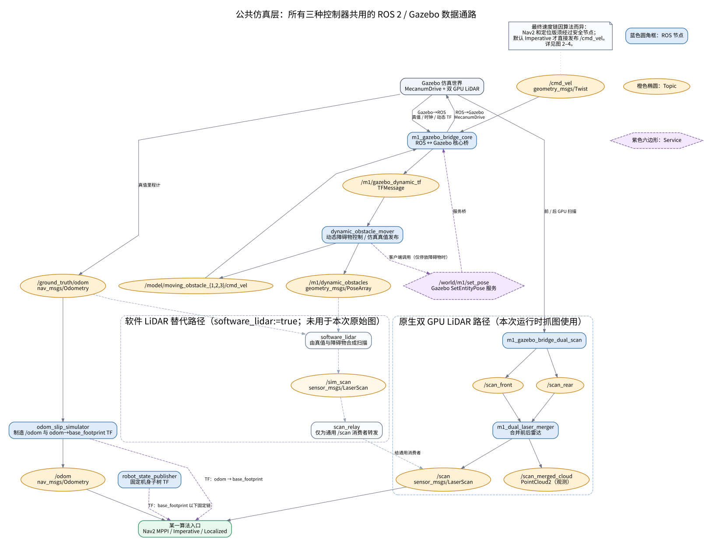
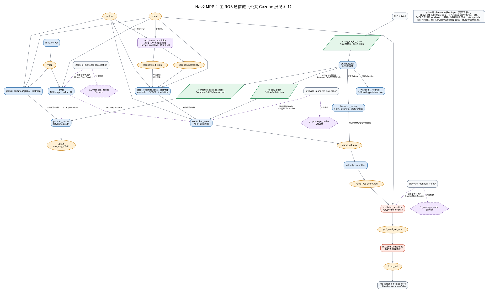
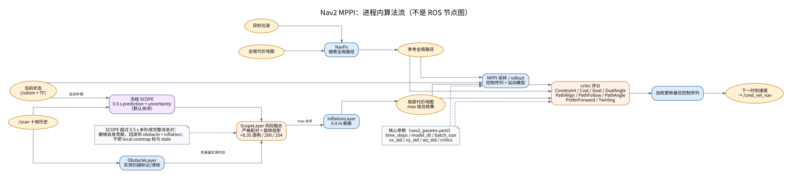
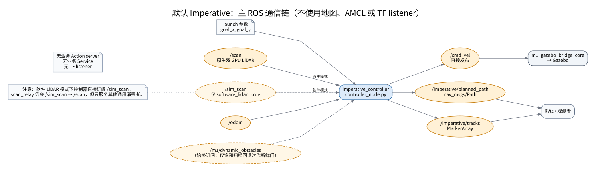
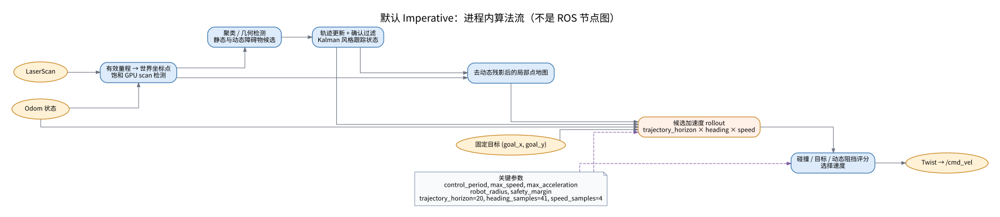
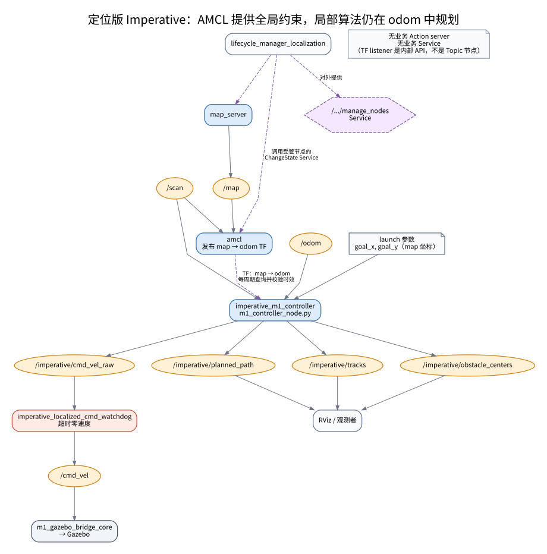
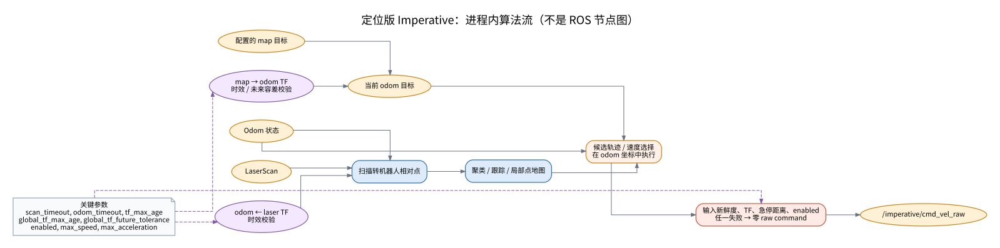

# M1 导航仿真架构：从 rqt_graph 到算法

本文覆盖三套**Gazebo 仿真**入口：Nav2 MPPI、默认 Imperative、定位版 Imperative。使用原生双 GPU LiDAR；实机 launch、串口底盘和外设不在本版范围。一次只运行一个控制器，避免多个节点同时发布 `/cmd_vel`。

## 图例与读图原则

| 图形/颜色 | 含义 |
| --- | --- |
| 蓝色圆角框 | ROS 节点 |
| 橙色椭圆 | ROS Topic；方向是发布者 → Topic → 订阅者 |
| 绿色平行四边形 | ROS Action |
| 紫色六边形 | ROS Service；紫色虚线也表示 TF 或生命周期调用 |
| 灰色便笺 | launch 参数、条件或不存在的接口 |

主图只保留主链。`/rosout`、`/parameter_events`、节点自动生成的参数 Service，以及 Action 的 feedback/status/cancel 子 Topic 在原始 rqt_graph 附录中保留。

## 先走一条消息

| 阶段 | Nav2 MPPI | 默认 Imperative | 定位版 Imperative |
| --- | --- | --- | --- |
| 给目标 | `/navigate_to_pose` Action | launch `goal_x, goal_y` | launch `goal_x, goal_y`，语义在 `map` 坐标 |
| 位姿 | AMCL 用 `/scan` + `/map` 发布 `map → odom`；局部控制仍用 `/odom` | 只用 `/odom`，无 AMCL/TF listener | `/odom` 做局部状态；每周期把 map 目标经 `map → odom` 变换为 odom 目标 |
| 感知 | `/scan` 进入 AMCL、两张 costmap、collision monitor | 原生订阅 `/scan`；软件模式直接订阅 `/sim_scan` | `/scan` 加 `odom ← laser` TF 生成局部点 |
| 规划 | NavFn 全局路径 + MPPI 局部控制 | 节点内聚类、跟踪、局部地图、rollout | 同类局部规划，但有全局 TF 时效门 |
| 最终命令 | `cmd_vel_nav → cmd_vel_smoothed → m1/cmd_vel_raw → cmd_vel` | 直接 `/cmd_vel` | `imperative/cmd_vel_raw → watchdog → /cmd_vel` |

`/cmd_vel` 才是 Gazebo 底盘最终接收的命令；在 Nav2 和定位版 Imperative 中，前面的速度 Topic 不等于最终底盘速度。

## 图 1：公共 Gazebo 层

[打开 SVG](architecture/01_common_simulation.svg)



### 公共节点

| 节点 | 责任 | 关键接口 |
| --- | --- | --- |
| `m1_gazebo_bridge_core` | ROS ↔ Gazebo 核心桥 | `/cmd_vel` 到 Gazebo；真值、时钟、动态 TF 回 ROS |
| `odom_slip_simulator` | 模拟带误差的里程计 | `/ground_truth/odom → /odom`，广播 `odom → base_footprint` |
| `robot_state_publisher` | 发布固定机身 TF | launch 参数 `robot_description` → `/tf_static`；不是订阅 `/robot_description` |
| `m1_gazebo_bridge_dual_scan` | 原生 GPU 前/后雷达桥 | Gazebo → `/scan_front`、`/scan_rear` |
| `m1_dual_laser_merger` | 合并双雷达 | `/scan_front` + `/scan_rear → /scan`，也发布 `/scan_merged_cloud` |
| `dynamic_obstacle_mover` | 驱动并公布动态障碍物 | `/m1/gazebo_dynamic_tf → /model/moving_obstacle_{1,2,3}/cmd_vel` 与 `/m1/dynamic_obstacles` |
| `software_lidar`、`scan_relay` | 仅 `software_lidar:=true` 的替代扫描链 | 真值 → `/sim_scan → /scan` |

### 公共接口

| 接口 | 类型 | 生产者 → 消费者 | 含义 |
| --- | --- | --- | --- |
| `/ground_truth/odom` | Topic | core bridge → slip simulator | Gazebo 真值，不是普通控制里程计 |
| `/odom` | Topic | slip simulator → 控制/定位 | 可配置滑移/噪声后的里程计 |
| `/scan_front`、`/scan_rear` | Topic | 双雷达 bridge → merger | 原生双 GPU LiDAR 的两路扫描 |
| `/scan` | Topic | merger → 三种算法的通用消费者 | 项目标准扫描接口 |
| `/sim_scan` | Topic | `software_lidar` → 默认 Imperative/relay | 软件 LiDAR 特例；默认 Imperative 软件模式不经 relay 读取它 |
| `/cmd_vel` | Topic | 最后控制/看门狗 → core bridge | **底盘最终速度** |
| `odom → base_footprint` | TF | slip simulator | 局部控制和 costmap 的位姿链 |
| `base_footprint` 以下 | TF | robot state publisher | 机身与传感器固定子树 |
| `/world/m1/set_pose` | Service | mover 客户端 → bridge → Gazebo | 仅停放障碍物时调用；不是 Topic |

最影响拓扑的公共 launch 参数是 `software_lidar`、`dual_gpu_lidar`、`render_engine`、`gpu_lidar_min_angle/max_angle`、`dynamic_obstacles`、`dynamic_seed`、`dynamic_motion_mode`。`slip_*`、比例/偏置/噪声与 burst 参数只改变 `/odom` 的数值，不增加算法节点。

## 图 2：Nav2 MPPI

[主 ROS 图](architecture/02_nav2_mppi_ros.svg) · [进程内算法图](architecture/02_nav2_mppi_internal.svg)





读法：目标 Action 先进入 `bt_navigator`；它调用 `planner_server` 的 NavFn Action，拿到 Path 结果后作为 `FollowPath` 的 Action goal 交给 `controller_server` 中的 MPPI 跟踪。`/plan` 是 planner 另外发布、用于观察的 Path Topic，不是 `FollowPath` 的 ROS Topic 输入。`behavior_server` 的恢复动作和 MPPI 正常速度都汇入 `/cmd_vel_nav`，因此共同经过平滑、碰撞门和最终 watchdog。

### 节点与生命周期

| 组 | 节点 | 责任 |
| --- | --- | --- |
| `lifecycle_manager_localization` | `map_server`、`amcl` | 静态地图与定位 |
| `lifecycle_manager_navigation` | `controller_server`、`planner_server`、`behavior_server`、`bt_navigator`、`waypoint_follower` | 目标、规划、路径跟踪、恢复、多路点 |
| `lifecycle_manager_safety` | `velocity_smoother`、`collision_monitor` | 平滑与碰撞门 |
| 独立 | `m1_cmd_watchdog` | raw command 超时后的最终停车 |

| 节点 | 主要输入 | 主要输出/职责 |
| --- | --- | --- |
| `amcl` | `/map`、`/scan`、TF | `map → odom`、`/amcl_pose`、粒子云 |
| `global_costmap/global_costmap` | `/map`、`/scan` | 全局静态/障碍物/膨胀代价地图 |
| `local_costmap/local_costmap` | `/scan`、`/odom` | 滚动局部代价地图 |
| `planner_server` | 全局 costmap、`ComputePath*` Action | NavFn Action result；另发布观察用 `/plan` |
| `controller_server` | `FollowPath`、局部 costmap、`/odom` | MPPI `/cmd_vel_nav`、轨迹可视化 |
| `behavior_server` | 恢复 Action、局部 costmap | 同样写 `/cmd_vel_nav` |
| `velocity_smoother` | `/cmd_vel_nav`、`/odom` | `/cmd_vel_smoothed` |
| `collision_monitor` | `/cmd_vel_smoothed`、`/scan`、TF | `/m1/cmd_vel_raw`；源码当前只配置 `PolygonStop` |

### 主要 Topic、Action、Service

| 接口 | 节点/角色 | 说明 |
| --- | --- | --- |
| `/map` | `map_server` → AMCL/global costmap | 静态占据栅格 |
| `/scan` | 图 1 merger → AMCL/costmap/collision monitor | 共同障碍物观测 |
| `/plan` | planner → RViz/观测者 | NavFn 发布的观察用全局路径；真正交给 `FollowPath` 的 Path 在 Action goal 中 |
| `/cmd_vel_nav` | controller、behavior → smoother | 正常和恢复动作的合流点 |
| `/cmd_vel_smoothed` | smoother → collision monitor | 平滑后、尚未最终放行 |
| `/m1/cmd_vel_raw` | collision monitor → watchdog | 碰撞门后的速度 |
| `/navigate_to_pose`、`/navigate_through_poses` | `bt_navigator` Action | 导航入口 |
| `/compute_path_to_pose`、`/compute_path_through_poses` | planner Action | 全局路径计算 |
| `/follow_path`、`/follow_waypoints` | controller/waypoint Action | 路径与路点执行 |
| `/spin`、`/backup`、`/drive_on_heading`、`/assisted_teleop`、`/wait` | behavior Action | 恢复行为 |
| `.../manage_nodes` | lifecycle manager **对外提供**的 Service | 外部请求配置/激活生命周期组；manager 再调用各受管节点自己的状态迁移 Service；不传递速度 |

每个 lifecycle node 也有标准状态迁移 Service；各节点自动参数 Service 不在业务接口表逐个列出。

### MPPI/安全关键参数

| 区域 | 参数 | 当前配置/含义 |
| --- | --- | --- |
| AMCL | `global_frame_id / odom_frame_id / base_frame_id` | `map / odom / base_footprint`；`OmniMotionModel`，`tf_broadcast: true` |
| NavFn | `GridBased.plugin` | `nav2_navfn_planner/NavfnPlanner`，`tolerance: 0.10` |
| MPPI | `motion_model, time_steps, model_dt, batch_size` | `Omni, 40, 0.05 s, 500`；采样纵向、横向、角速度 |
| MPPI | `vx_std/vy_std/wz_std`、`vx_max/vy_max/wz_max` | `0.3/0.3/0.5`；`0.5/0.5/0.8` |
| MPPI | `critics` | Constraint、Cost、Goal、GoalAngle、PathAlign、PathFollow、PathAngle、PreferForward、Twirling |
| costmap | global/local 的 `global_frame` | 分别是 `map` 与 `odom`，obstacle layer 都订阅 `/scan` |
| safety | `smoothing_frequency`、碰撞输入/输出 | 20 Hz；`/cmd_vel_smoothed → /m1/cmd_vel_raw` |
| watchdog | `watchdog_timeout/publish_rate` | 0.40 s / 20 Hz |
| launch | `navigation_start_delay` | 默认 35 s；等待 `/odom` 和 AMCL TF 再激活导航组 |

## 图 3：默认 Imperative

[主 ROS 图](architecture/03_imperative_default_ros.svg) · [进程内算法图](architecture/03_imperative_default_internal.svg)





这条链最短：`imperative_controller` 读取扫描、`/odom` 和固定 launch 目标，**直接**发 `/cmd_vel`。它没有 Map、AMCL、Nav2 Action、业务 Service、TF listener 或独立 watchdog；不要把它误读成“也会经过 Nav2 安全链”。

| 节点/接口 | 责任 |
| --- | --- |
| `imperative_controller` | `controller_node.py` 的 ROS 适配层；发布命令、路径和轨迹 Marker |
| `/scan` / `/sim_scan` | 原生 / 软件 LiDAR 的控制器输入；软件模式时控制器直接用 `/sim_scan` |
| `/odom` | 位置、朝向、速度输入 |
| `/m1/dynamic_obstacles` | 始终订阅的仿真真值辅助；仅 GPU `/scan` 饱和回退且 `require_dynamic_obstacles=true` 时才作为“必须新鲜”的停车门 |
| `/cmd_vel` | 直接通向 core bridge 的输出 |
| `/imperative/planned_path`、`/imperative/tracks` | RViz/观测用途，不参与底盘命令 |

| 参数类别 | 关键参数 |
| --- | --- |
| 目标/周期 | `goal_x=2.5`、`goal_y=1.5`、`control_period=0.1` |
| 速度/几何 | `max_speed=1.0`、`max_acceleration=1.0`、`robot_radius=0.15`、`safety_margin=0.15` |
| rollout | `trajectory_horizon=20`、`trajectory_heading_samples=41`、`trajectory_speed_samples=4` |
| 接口 | 原生 `scan_topic=/scan`，软件 `scan_topic=/sim_scan`，launch 强制 `command_topic=/cmd_vel` |
| 动态/退化 | `dynamic_obstacle_radius=0.20`、`dynamic_obstacle_timeout=0.5`；GPU 扫描饱和时只允许配置的静态障碍物和新鲜仿真真值辅助 |

内部算法顺序是“扫描点 → 聚类检测 → 轨迹更新/确认过滤 → 去动态残影的局部地图 → 候选加速度 rollout → 碰撞/目标评分 → Twist”。这些方框不是 ROS 节点，所以不会出现在 rqt_graph。

## 图 4：定位版 Imperative

[主 ROS 图](architecture/04_imperative_localized_ros.svg) · [进程内算法图](architecture/04_imperative_localized_internal.svg)





定位版不是“把 Nav2 planner 换成 Imperative”。它只复用 `map_server + AMCL` 给全局坐标约束；`imperative_m1_controller` 仍在 `odom` 坐标中做局部感知与速度选择。每周期将 map 目标用最新 `map → odom` TF 转换；TF 缺失、过期、未来时间不合法，或扫描/里程计/雷达 TF 过期，都会输出零 raw command。

| 节点/接口 | 责任 |
| --- | --- |
| `map_server`、`amcl`、`lifecycle_manager_localization` | 与 Nav2 定位组相同；AMCL 发布 `map → odom` |
| `imperative_m1_controller` | `m1_controller_node.py`；有 TF buffer/listener，订阅 `/scan`、`/odom` |
| `/imperative/cmd_vel_raw` | 算法原始速度；不直接到 Gazebo |
| `imperative_localized_cmd_watchdog` | 20 Hz 转发 raw command；超过 0.40 s 未更新就将 `/cmd_vel` 置零 |
| `/imperative/planned_path`、`/imperative/tracks`、`/imperative/obstacle_centers` | 三个可视化 Topic |

| 参数类别 | 关键参数 |
| --- | --- |
| 坐标/目标 | `goal_frame=map`、`global_frame=map`、`odom_frame=odom`；`goal_x/y` 是 map 坐标 |
| 使能 | `enabled:=false` 默认 dry-run；设为 true 才允许物理命令通过节点 |
| 全局 TF 门 | `global_tf_max_age=0.5`；仿真 launch 的 `global_tf_future_tolerance=0.5` s |
| 本地输入门 | `scan_timeout=0.50`、`odom_timeout=0.50`、`tf_max_age=0.30` |
| 速度/rollout | `max_speed=0.18`、`max_acceleration=0.25`、`robot_radius=0.18`、`safety_margin=0.18`；20/41/4 rollout 采样 |

没有业务 Action server 或业务 Service。TF listener 是进程内 API，不应画成一个订阅 `/tf` 的“算法节点”；自动参数 Service 同样不属于业务接口。

## 三种入口的差异

| 问题 | Nav2 MPPI | 默认 Imperative | 定位版 Imperative |
| --- | --- | --- | --- |
| 目标输入 | Action | launch 参数 | map 坐标 launch 参数 |
| 全局定位 | Map + AMCL | 无 | Map + AMCL，仅供目标变换 |
| 全局路径 | NavFn Action result（另发布观察用 `/plan`） | 无 | 无 |
| 局部控制 | MPPI + local costmap | 内部点/轨迹模型 | 内部点/轨迹模型 |
| 规划坐标 | Nav2 map/odom TF 体系 | odom | odom，map 目标每周期转换 |
| 最后速度链 | 平滑 + collision + watchdog | 直接 `/cmd_vel` | 独立 watchdog 后 `/cmd_vel` |
| Action | 完整 Nav2 导航/恢复集合 | 无 | 无 |

## 原始运行时 rqt_graph 附录

以下快照在 2026-09-06 的隔离 ROS domain 中生成。它们不是手工简化图：仓库的 [`tools/export_rqt_graph.py`](../tools/export_rqt_graph.py) 调用 `rqt_graph` Nodes/Topics DOT 生成器，等待 3 秒 DDS 发现稳定，排除导出器自身并隐藏常规噪声。bond、诊断和 Action 子 Topic 仍会保留。

| 入口与条件 | SVG | DOT |
| --- | --- | --- |
| Nav2 MPPI；原生双 GPU LiDAR，`software_lidar:=false`，`dynamic_obstacles:=false` | [SVG](architecture/raw/nav2_mppi_native.svg) | [DOT](architecture/raw/nav2_mppi_native.dot) |
| 默认 Imperative；原生双 GPU LiDAR，`software_lidar:=false`，`dynamic_obstacles:=false` | [SVG](architecture/raw/imperative_default_native.svg) | [DOT](architecture/raw/imperative_default_native.dot) |
| 定位版 Imperative；原生双 GPU LiDAR，`software_lidar:=false`，`dynamic_obstacles:=false`，`enabled:=false` | [SVG](architecture/raw/imperative_localized_native.svg) | [DOT](architecture/raw/imperative_localized_native.dot) |

复现导出时先 source 当前工作区：

```bash
source /opt/ros/humble/setup.bash
source install/setup.bash
python3 tools/export_rqt_graph.py --output docs/architecture/raw/snapshot.dot
dot -Tsvg docs/architecture/raw/snapshot.dot -o docs/architecture/raw/snapshot.svg
```

原始图是“当时发现到的 ROS endpoint”，而主图和接口表给出系统角色；两者应结合阅读。
