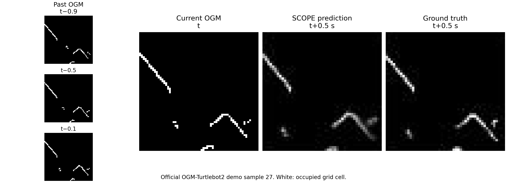

# 工作日志：导航仿真停机加固与 SCOPE 官方基线定性复现

**日期：2026-09-05**
**项目：rosmaster-m1-project**

## 目标

当天工作分为两条独立工作线：

1. 加固 M1 的 Imperative / Nav2 导航仿真入口、控制指令安全链和进程停机边界；
2. 在项目外独立复现 SCOPE 官方 baseline，并保留一张官方测试集的未来 OGM 定性图。

第二项只用于确认官方 SCOPE checkpoint 可以完成未来占据栅格预测；本项目的 M1
仿真尚未接入 SCOPE，因此不能把该图解释为 M1 系统的导航或避障结果。

## 1. M1 导航仿真与停机安全加固

### 实施

当天提交 `98a7513`（`Harden Imperative navigation simulation and shutdown handling`）完成了以下改动：

- 补充 Imperative 原始仿真、局部化 Imperative 仿真和 Nav2 仿真三个入口的说明与
  系统架构文档；将动态障碍的 seed、运动模式，以及 GPU LiDAR 的渲染、双雷达和角度
  参数向下转发，使场景配置能够复现。
- 局部化 Imperative 在解析 `map → odom` 目标变换时增加有限的 future tolerance，
  以容纳 AMCL 时间戳的有限超前；过期、缺失或超出容差的变换仍被拒绝。
- 将 Nav2 behavior server 的恢复速度指令路由到 `/cmd_vel_nav`，保持其经过既有安全链。
- 为控制器发布增加 ROS context / publisher 失效处理；SIGINT 停机期间，由独立
  watchdog 负责最终零速度安全边界，避免 timer 回调与节点销毁并发时再次发布。

当天提交 `a9a1ea6`（`Remove collision slowdown polygon`）将 Collision Monitor
配置收敛为只保留 stop polygon，移除了 slowdown polygon，并同步更新 RViz 配置及
参数回归断言。

### 验证与边界

两条提交均补充或更新了回归测试代码，覆盖启动参数、局部化目标解析、速度路由和
Collision Monitor 参数约束。本日志只记录代码级回归覆盖；未在此记录中声称已经完成
完整运行时仿真、长时导航或停机行为的端到端验证。

## 2. SCOPE 官方 baseline：未来 OGM 定性图

下图来自项目外单独运行的 TempleRAIL/SCOPE 官方 `scope` 分支，使用其
OGM-Turtlebot2 官方测试集与官方 demo 输出。选择的是测试样本 #27，预测 horizon
为 **0.5 s**。

图中黑色表示未标记为占据的栅格，白色表示 LiDAR 栅格化后的占据区域。四个区域从左到右为：

1. **Past OGM**：过去时刻的局部 OGM；
2. **Current OGM**：当前时刻 `t` 的局部 OGM；
3. **SCOPE prediction**：官方模型对 `t + 0.5 s` 的预测 OGM；
4. **Ground truth**：`t + 0.5 s` 的实际 OGM，用于定性对照。

预测图与真值图均直接取自官方 demo 的对应输出；过去与当前 OGM 依据作者的
`LocalMap` 预处理重建。该图只展示一个样本的定性可视化，不提供总体精度、成功率或
动态障碍运动预测成功的统计结论。

## 3. 提交记录

- `98a7513 Harden Imperative navigation simulation and shutdown handling`
- `a9a1ea6 Remove collision slowdown polygon`

## 4. 后续

M1 导航系统与 SCOPE 官方 baseline 继续保持独立。在完成官方 baseline 的完整定量
验证和接口设计前，不将 SCOPE 的单样本定性图作为 M1 导航性能证据。
