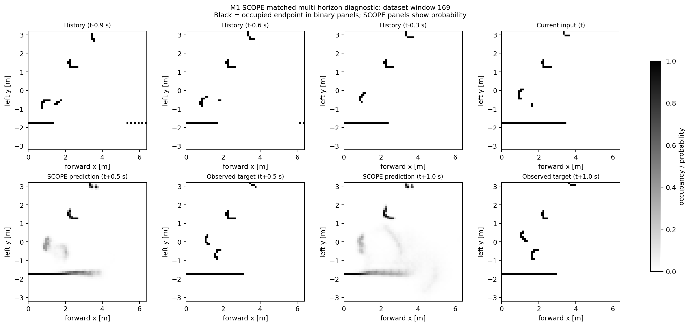
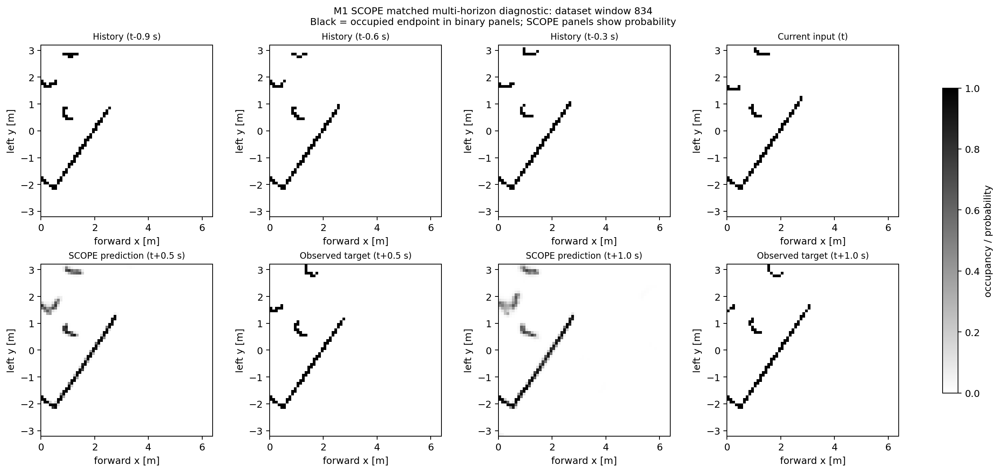
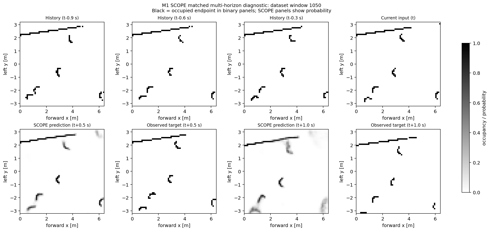
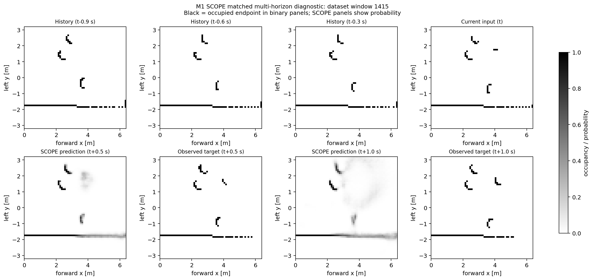

# M1 动态障碍物的预训练 SCOPE 离线预测测试

日期：2026-09-06

## 1. 目标与边界

本记录验证：不使用 M1 数据重新训练，直接加载官方预训练 SCOPE，能否预测 M1 Gazebo 场景中动态障碍物在未来 0.5 s 和 1.0 s 的占据位置。

测试是离线 OGM 预测评估，不将 SCOPE 接入 Nav2，不发布控制指令，不修改 Imperative 控制器。因此它不构成闭环导航收益、安全性、实时性或实机部署能力的证明。

官方 SCOPE 工作副本始终保持 Git clean，提交为 `211b199ebfcbe54eeac99202bbe62aca593f7bed`。推理直接加载未修改的 `model.py`、`convlstm.py` 与 `model/scope_model.pth`；精确哈希见文末证据文件。

## 2. 数据采集与数据集构建

### 2.1 仿真场景与动态障碍物

场景中有 3 个移动圆柱体。正式测试使用默认 `continuous` 平滑随机运动模式和固定随机种子 `20260814`：速度与方向会在随机时间间隔内更新，并受加速度、房间边界及障碍物间安全距离约束。因此障碍物不是恒速运动。

| 障碍物 | 连续模式目标速度范围 | 加速度上限 | 录制轨迹平均速度 | 录制轨迹 p95 速度 |
|---|---:|---:|---:|---:|
| `moving_obstacle_1` | 0.12–0.62 m/s | 0.45 m/s² | 0.297 m/s | 0.561 m/s |
| `moving_obstacle_2` | 0.15–0.70 m/s | 0.50 m/s² | 0.361 m/s | 0.637 m/s |
| `moving_obstacle_3` | 0.18–0.78 m/s | 0.55 m/s² | 0.368 m/s | 0.713 m/s |

表中的实际速度由 `/m1/dynamic_obstacles` 发布的 Gazebo 真值位姿按相邻 30 Hz 样本差分得到；它反映本次录制中的运动，不是额外的速度限值。备用 `random_waypoint` 模式才使用固定巡航速度 0.34、0.42、0.50 m/s；本次没有使用该模式。

机器人通过固定 Nav2 目标产生前进、横移和转动组合。正式 bag 长 188.670 s，包含 2,267 帧扫描（12.048 Hz）、5,536 条里程计、5,534 条真值里程计和 5,645 条动态障碍物位姿消息。扫描运动覆盖包括 642 帧前进、618 帧横移、335 帧转动和 254 帧横移加转动。

### 2.2 机器人运动与 rosbag 录制

录制前启动 M1 Gazebo 场景并启用三个动态障碍物。机器人依次执行固定导航目标：`(-2.5, 1.5, 0)`、`(2.5, 1.5, π/2)`、`(2.5, -1.5, π)`、`(-2.5, -1.5, 0)`，最后重复第一个目标。该序列只用于让同一份 bag 覆盖直行、横移与转向时的传感器数据，不是导航成功率或避障性能测试。

机器人和障碍物同时运动时，rosbag 录制 `/scan`、`/odom`、`/ground_truth/odom`、`/m1/dynamic_obstacles`、`/cmd_vel`、`/tf`、`/tf_static` 与 `/clock`。录制结束后，bag 时长为 188.670 s；`/cmd_vel` 有 3,764 条记录，其中 1,248 条非零，说明机器人不是静止采样。`/m1/dynamic_obstacles` 约以 30 Hz 发布三个 Gazebo 真值障碍物中心，后续仅用于离线构建和测量动态 ROI。

### 2.3 数据导出与预处理

导出器保留 `/scan`、`/odom`、`/ground_truth/odom`、`/m1/dynamic_obstacles`、`/cmd_vel`、`/tf`、`/tf_static` 与 `/clock`。激光坐标系为 `laser_scan_link`，每帧 667 束。2,266 帧扫描拥有共同时间覆盖；最近扫描—里程计时间差最大 0.017 s、平均 0.00850 s。

预处理器以实际扫描时间戳构造 10 Hz 的 `[N,10,1,64,64]` 二值历史输入。栅格分辨率为 0.1 m，范围为前向 `x=[0,6.4)` m、向左 `y=[-3.2,3.2)` m。历史扫描通过插值 SE(2) 里程计和 `base_footprint` 到激光的 `tf_static` 变换（`[0.010059, 0, 0]`）补偿至未来激光坐标系；标签是未来时刻直接观测到的扫描。

| 预测时域 | 有效窗口 | 非空动态 ROI 窗口 | 最大历史时间不匹配 |
|---|---:|---:|---:|
| 0.5 s（5 步） | 1,866 | 1,728 | 0.041 s |
| 1.0 s（10 步） | 1,861 | 1,723 | 0.041 s |

动态 ROI 是未来真值动态障碍物中心周围半径 0.45 m 的圆盘。扫描时刻里程计与真值的无滑移检查接近零（平移 RMSE `3.88e-19` m，偏航 RMSE `2.54e-15` rad），所以这次 Gazebo 录制中以里程计进行补偿是自洽的。

## 3. 实验设置与测试方法

### 3.1 推理与评分协议

正式评估使用 Python 3.7.16、PyTorch 1.7.1、NumPy 1.21.5、随机种子 1337、占据阈值 0.5，以及每窗口 32 个预测样本。每个时域均从有效窗口中确定性均匀抽取 200 个窗口。当前环境未启用 CUDA，延迟仅代表 CPU。

只在动态 ROI 内对未来真实占据格评分。比较对象是 `copy-last`：直接把当前扫描栅格作为未来预测。空 ROI 窗口不参与 IoU、F1、Precision 和 Recall 的 Macro 平均。0.5 s 正式评估对每窗口执行 5 次自回归前向，1.0 s 执行 10 次；32 个样本在同一窗口内汇总为像素级预测均值后参与评分。

对每个 ROI 像素，`TP` 是预测占据且真实占据，`FP` 是误报，`FN` 是漏报：

```text
IoU = TP / (TP + FP + FN)
F1  = 2TP / (2TP + FP + FN)
```

两项指标均在 0 到 1 之间，越高表示预测占据位置与未来真实观测的重叠越多。Micro 先汇总全部窗口的 TP、FP、FN 后计算；Macro 先按窗口计算再取平均，使每个有效窗口权重相同。

### 3.2 测试与完整性检查

测试包含数据、几何和评估三个层次。数据导出检查扫描束数及其几何在整段 bag 内一致，并按 LaserScan 元数据过滤 NaN、Inf 与超量程值。时间同步检查要求扫描、里程计、真值和动态障碍物数据拥有共同覆盖区间，里程计插值不允许外推，偏航使用最短角度插值。坐标检查要求 `tf_static` 能解析基座到激光的变换链；静态墙在自车运动补偿后应保持对齐；若里程计与真值的滑移语义不一致，动态 ROI 构建会拒绝运行。

评估工具还自动测试窗口选择、显式图像窗口、IoU/F1 的 Micro/Macro、空分母处理、动态 ROI mask、预测步数描述以及 0.5 s/1.0 s 图的锚时刻匹配。当前离线工具自动化测试共 12 项通过；在排除仓库既有 E501 行宽基线后，改动通过 flake8，且 `git diff --check` 通过。端到端方面，官方 checkpoint 已实际加载并分别完成 0.5 s、1.0 s 的 200 窗口推理；评估器在运行前后校验官方 SCOPE 的 Git 状态和源码/checkpoint 哈希。这些检查验证离线数据链路和评估实现，不是实机或闭环导航测试。

## 4. 动态障碍物 ROI 结果

| 预测时域 | 方法 | Micro 占据 IoU | Micro F1 | Macro 占据 IoU | Macro F1 | CPU 平均延迟 |
|---|---|---:|---:|---:|---:|---:|
| 0.5 s | 预训练 SCOPE | 0.2015 | 0.3354 | 0.2093 | 0.3246 | 3.724 s/窗口 |
| 0.5 s | copy-last | 0.1769 | 0.3007 | 0.1868 | 0.2877 | — |
| 1.0 s | 预训练 SCOPE | 0.0607 | 0.1144 | 0.0649 | 0.1111 | 7.744 s/窗口 |
| 1.0 s | copy-last | 0.0786 | 0.1457 | 0.0784 | 0.1326 | — |

0.5 s 时，预训练 SCOPE 在动态障碍物 ROI 内的 IoU 和 F1 高于 copy-last，说明它在该局部短时预测任务上具有可测量的优势。1.0 s 时，SCOPE 的 IoU 和 F1 均低于 copy-last；随着预测时域从 0.5 s 延长到 1.0 s，SCOPE 的 Micro IoU 从 0.2015 降至 0.0607，Micro F1 从 0.3354 降至 0.1144。

因此，当前冻结的零样本模型只在本测试的 0.5 s 局部动态 ROI 上显示相对优势，不能据此主张其具备 1.0 s 预测优势、部署条件、闭环导航收益或安全性保证。

## 5. 不同阶段的多时域预测图

将 200 个正式 0.5 s 评估窗口按时间序列分为四段：`0–49`、`50–99`、`100–149`、`150–199`。每段选择“未来真值占据格 ∩ 动态 ROI”数目最大的窗口；若并列则取更早窗口。这个规则保证图中有动态障碍物，但不根据 SCOPE 的 IoU、F1 或预测误差挑选样本。

四个样本的评估序号为 `18 / 89 / 112 / 151`，对应数据集窗口 `169 / 834 / 1050 / 1415`。每张图均为 `2×4`：上排是 `t-0.9 s`、`t-0.6 s`、`t-0.3 s` 与当前 `t`；下排是预测 `t+0.5 s`、真实 `t+0.5 s`、预测 `t+1.0 s` 与真实 `t+1.0 s`。二值面板中黑色表示被扫描端点标记为占据，白色表示未标记为占据；SCOPE 面板显示占据概率。

`t+0.5 s` 面板来自正式 200 窗口评估。为在完全相同的锚时刻绘制 `t+1.0 s`，对这四个指定窗口使用相同官方权重、32 samples、种子和阈值补算了 10 步预测。该四窗口补算只用于成对可视化，不参与或替代上述 200 窗口指标。

### 阶段 1：评估序号 18，数据集窗口 169



### 阶段 2：评估序号 89，数据集窗口 834



### 阶段 3：评估序号 112，数据集窗口 1050



### 阶段 4：评估序号 151，数据集窗口 1415



## 6. 结果解读与限制

这些图中的黑色表示激光端点占据栅格，不是完整的障碍物轮廓。长而连续的黑线通常是墙体，短小弯曲或离散的端点簇可能是圆柱障碍物的可见表面；遮挡会使同一障碍物在某些时刻只留下很少端点。上排历史帧已经补偿到预测时刻的激光坐标系，所以墙体在多帧间大体对齐是运动补偿链路正常的可视检查，而动态端点的残余变化才是模型需要外推的内容。

四张图都按照动态 ROI 内未来真值占据量选择，目的是清楚展示动态物体，而不是代表所有窗口的平均难度。因此结论以第 4 节 200 窗口的指标为准。图中可见，0.5 s 预测常在未来动态端点附近给出概率响应，但位置和形状不总是精确；这与 SCOPE 相对 copy-last 的有限提升（Micro IoU/F1 分别高 0.0246/0.0348）相符。

从 0.5 s 延长到 1.0 s 后，图中的预测概率区域更分散，漏检和位置漂移更多；量化结果也显示 SCOPE 的 Micro IoU/F1 从 0.2015/0.3354 降至 0.0607/0.1144，并低于 copy-last。可能原因包括动态端点稀疏、遮挡、时域变长后的自车补偿误差累积，以及冻结预训练模型与当前 M1 场景之间的数据域差异。该结果不表示模型完全不能预测运动，但说明当前零样本设置只显示有限的 0.5 s 局部收益，不能据此推导 1.0 s 预测优势、闭环避障收益或安全性保证。

## 7. 可追溯产物

- 0.5 s 紧凑指标与官方来源：[2026-09-06_scope_m1_metrics.json](evidence/2026-09-06_scope_m1_metrics.json)
- 1.0 s 动态 ROI 指标与官方来源：[2026-09-06_scope_m1_h10_dynamic_roi_metrics.json](evidence/2026-09-06_scope_m1_h10_dynamic_roi_metrics.json)
- 大型 bag、中间数组、逐窗口 CSV 与预测数组位于被 Git 忽略的 `artifacts/scope_m1/`，故意不纳入版本控制。

## 8. ROS 2 在线观测节点（与上述离线结果分开记录）

在完成上述冻结离线评估后，新增了 `m1_scope_predictor` ROS 2 节点。它订阅 `/scan` 和 `/odom`，复用与离线导出器相同的十帧、64×64 历史栅格预处理，异步执行最新任务优先的 SCOPE 推理，并发布当前端点栅格、0.5 s 预测概率栅格、不确定性栅格和诊断信息。它不发布 `/cmd_vel`，不修改 Nav2 costmap，也不参与 MPPI 或任何控制决策；Nav2 的 `scope_enabled` 默认仍为 `false`。

严格的 Python 3.7 / PyTorch 1.7.1 离线复现实验仍是参考基线。在线节点在独立的 Python 3.10 虚拟环境中运行 PyTorch 2.5.1+cu124，并以启动时 SHA-256 校验外部 checkpoint 与随包保留的官方 `model.py`、`convlstm.py`。在相同 0.5 s、32-sample 协议下，对 100 个离线窗口的新旧运行时比较得到：平均预测概率 MAE 为 `0.000449`，总体 F1 与 IoU 的绝对差分别为 `0.000956` 和 `0.001074`，动态 ROI F1 与 IoU 的绝对差分别为 `0.000905` 和 `0.000641`。这些数值是运行时一致性检查，不是模型精度或导航性能指标。

| 验证项目 | 结果 |
|---|---|
| Python 单元测试（共享预处理、流式缓存、推理、评估、包契约） | 66 项通过 |
| `m1_scope_bridge`、`m1_scope_predictor`、`m1_nav2_bringup` 的 `colcon test` | 65 项通过，零失败 |
| GPU 纯推理（4 samples，10 次热身后） | 平均 `24.17 ms`，约 `41.4 Hz` |
| Gazebo + Nav2 + SCOPE 联合启动 | 在线输出约 `7.9 Hz`，单次推理约 `73.3 ms`，CUDA 已分配内存约 `3.67 MB` |

联合启动期间，`/scope/diagnostics` 的在线评估器能够输出预测与未来激光观测之间的端点栅格 MAE、IoU 和 F1。该评估仅用于时间/坐标链路自检：它使用 Gazebo `/ground_truth/odom` 对齐未来扫描，不能代表闭环避障、实时保证或实机安全性。对含有 `/clock` 的原始 bag 回放时不得再使用 `ros2 bag play --clock`，否则会同时产生两个时钟源并使预测年龄诊断失真。

启动方式、话题语义与帧定义见 [SCOPE 在线节点说明](../scope_online.md)。
