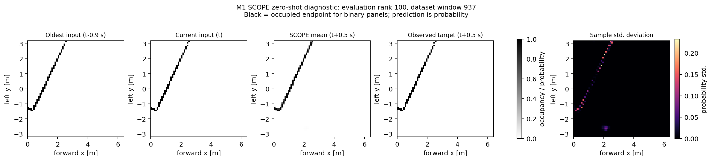

# M1 to pretrained SCOPE offline integration

Date: 2026-09-06

## Scope and evidence boundary

This work adds an independent, offline M1-to-SCOPE data path. It does not connect SCOPE to Nav2,
publish velocity commands, alter the Imperative controller, or establish navigation/safety/hardware
performance. The result is a simulation-domain, zero-shot OGM prediction evaluation against a
copy-last persistence baseline.

The official SCOPE checkout remained Git-clean at commit
`211b199ebfcbe54eeac99202bbe62aca593f7bed`. Inference loaded the unmodified official `model.py`,
`convlstm.py`, and `model/scope_model.pth`; their hashes are recorded in the compact evidence JSON.

## Dataset capture

The formal Gazebo bag is 188.670 s and contains 2,267 scans (12.048 Hz), 5,536 odometry messages,
5,534 ground-truth odometry messages, and 5,645 dynamic-obstacle pose messages. Fixed Nav2 goals
were used only to generate motion diversity. Coverage includes 642 forward, 618 lateral, 335
rotational, and 254 simultaneous lateral-plus-rotational scan frames.

The exporter retained `/scan`, `/odom`, `/ground_truth/odom`, `/m1/dynamic_obstacles`, `/cmd_vel`,
`/tf`, `/tf_static`, and `/clock`. There are 667 beams in frame `laser_scan_link`; 2,266 scans share
valid time coverage. Nearest scan-to-odom mismatch is at most 0.017 s (mean 0.00850 s). The
simulation no-slip check between odometry and ground truth at scan times is effectively zero
(translation RMSE `3.88e-19` m, yaw RMSE `2.54e-15` rad), so odometry-based compensation is valid
for this captured simulation run only.

## SCOPE-compatible preprocessing

The preprocessor constructs `[N,10,1,64,64]` binary histories at 10 Hz with 0.1 m cells over
`x=[0,6.4)` m forward and `y=[-3.2,3.2)` m left. It uses actual scan timestamps, earlier-scan tie
breaking, interpolated SE(2) odometry, and the `tf_static` transform from `base_footprint` to the
lidar (`[0.010059, 0, 0]`). Past scans are compensated into the predicted future lidar frame; the
label is the directly observed scan 0.5 s later.

Of 1,867 candidates, 1,866 windows are valid; one fails common time coverage and none fail scan
tolerance or duplicate-history checks. Maximum history mismatch is 0.041 s. A 0.45 m disk around
future-frame ground-truth dynamic-obstacle centers yields 1,728 nonempty ROI windows. Constant-twist
future-pose prediction differs from future ground truth by 0.0253 m translation RMSE and 0.0374 rad
yaw RMSE. These are preprocessing diagnostics, not navigation errors.

## Frozen pretrained evaluation

The formal run uses Python 3.7.16, PyTorch 1.7.1, NumPy 1.21.5, seed 1337, threshold 0.5, 32 samples,
and 200 deterministic evenly spaced windows spanning indices 0 through 1865. CUDA was unavailable in
this execution context, so latency is CPU-only: mean 3.724 s, median 3.738 s, p95 3.878 s per window,
where one window means five autoregressive forwards over the 32-sample batch.

| Region | Method | Micro occupied IoU | Micro F1 | Macro occupied IoU | Macro F1 |
|---|---|---:|---:|---:|---:|
| Full 64x64 grid | pretrained SCOPE | 0.5000 | 0.6666 | 0.5131 | 0.6636 |
| Full 64x64 grid | copy-last | 0.5894 | 0.7417 | 0.6116 | 0.7382 |
| Dynamic ROI | pretrained SCOPE | 0.2015 | 0.3354 | 0.2093 | 0.3246 |
| Dynamic ROI | copy-last | 0.1769 | 0.3007 | 0.1868 | 0.2877 |

The zero-shot evidence classification is **mixed**. Pretrained SCOPE improves occupied-cell IoU and
F1 inside the dynamic-obstacle ROI, while copy-last is better on both metrics over the full grid.
This supports that the adapter and frozen baseline run coherently and suggests localized dynamic
forecasting value, but it does not support a claim of overall superiority, deployment readiness, or
closed-loop navigation benefit.

The five-panel figure uses evaluation rank 100 (dataset window 937), chosen mechanically as the
middle evaluated rank rather than by metric. In its binary panels black means an occupied lidar
endpoint and white means not marked occupied; the prediction panel is probability and the final
panel is pixel-wise sample standard deviation.

Compact metrics and provenance: [2026-09-06_scope_m1_metrics.json](evidence/2026-09-06_scope_m1_metrics.json)

Large bags, intermediate arrays, predictions, and per-window CSV files remain under the ignored
`artifacts/scope_m1/` tree and are intentionally excluded from Git.
